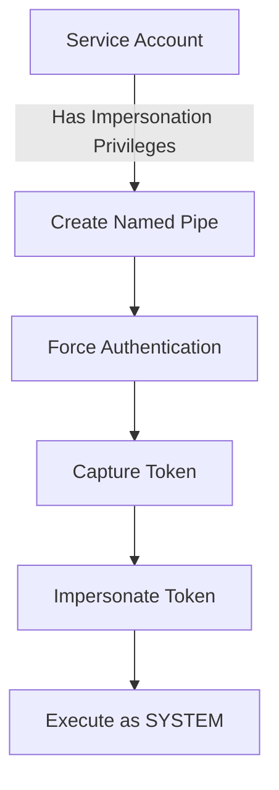

[[Windows Privilege Escalation]]
## Detailed Attack Variations

### 1. Hot Potato
**Mechanism:**
- Combines NBNS spoofing
- WPAD proxy abuse
- NTLM relay attack
- Local privilege escalation

**Technical Flow:**
1. NBNS spoofing to redirect WPAD queries
2. Fake WPAD proxy setup
3. HTTP to SMB NTLM relay
4. Token capture and privilege escalation

### 2. Sweet Potato
**Key Components:**
- Uses COM instead of NBNS/WPAD
- Exploits Windows RPC
- Targets specific COM servers
- Leverages token impersonation

**Process:**
1. Creates COM server instance
2. Forces authentication through RPC
3. Captures and impersonates token
4. Escalates to SYSTEM privileges

### 3. Rotten Potato
**Core Elements:**
- Exploits DCOM activation
- Manipulates RPC responses
- Uses named pipe impersonation
- Targets token privileges

### 4. Juicy Potato
**Advanced Techniques:**
- Creates custom COM servers
- Exploits DCOM activation
- Uses token stealing primitives
- Leverages CLSID manipulation

## Technical Deep Dive

### Token Impersonation Mechanics


### Protection Strategies

1. **Token Security:**
   - Implement token security checks
   - Monitor token creation/usage
   - Restrict token delegation
   - Audit impersonation privileges

2. **Service Hardening:**
   ```Powershell
   - Disable unnecessary COM servers
   - Restrict RPC communication
   - Implement service isolation
   - Use Protected Users group
   ```

3. **Advanced Monitoring:**
   - Track token creation events
   - Monitor service account activity
   - Log impersonation attempts
   - Alert on privilege escalation

### Registry Mitigations
Key registry locations to monitor and harden:
```Powershell
HKLM\SOFTWARE\Microsoft\Windows NT\CurrentVersion\Windows
HKLM\SYSTEM\CurrentControlSet\Control\Lsa
HKLM\SOFTWARE\Microsoft\COM3
```

## Detection Methods

### 1. Event Log Monitoring
Important Event IDs:
- 4624: Account Logon
- 4648: Explicit Credential Logon
- 4656: Handle to Object Requested
- 4674: Privileged Operation

### 2. Process Creation Monitoring
Key indicators:
```Powershell
- Unexpected SYSTEM processes
- Service account anomalies
- Token manipulation patterns
- COM server creation
```

### 3. Network Traffic Analysis
Monitor for:
- Unusual RPC traffic
- NTLM authentication attempts
- Named pipe creation
- COM/DCOM activity

## Advanced Mitigation Techniques

### 1. Service Account Configuration
```powershell
# Example Group Managed Service Account creation
New-ADServiceAccount -Name "RestrictedService" `
                    -DNSHostName "service.domain.com" `
                    -PrincipalsAllowedToRetrieveManagedPassword "Domain Admins" `
                    -KerberosEncryptionType AES256
```

### 2. Security Policy Implementation
```
- Enable LSA protection
- Implement credential guard
- Configure protected process light
- Restrict token creation
```

### 3. COM Server Hardening
```reg
[HKEY_LOCAL_MACHINE\SOFTWARE\Microsoft\COM3\...]
"LaunchPermissions"=hex:...
"AccessPermissions"=hex:...
```

## Proactive Defense Measures

1. **System Configuration:**
   - Application allowlisting
   - Service account isolation
   - Network segmentation
   - Privilege boundary enforcement

2. **Monitoring Setup:**
   - Real-time token monitoring
   - Service account auditing
   - Process creation tracking
   - Privilege use logging

3. **Response Procedures:**
   - Incident response playbooks
   - Token abuse detection
   - Service account lockdown
   - System isolation protocols

## Advanced Logging Configuration
```xml
<EventLog>
  <Audit>
    <TokenRights>Success,Failure</TokenRights>
    <PrivilegeUse>Success,Failure</PrivilegeUse>
    <ProcessCreation>Success</ProcessCreation>
    <ServiceOperations>Success,Failure</ServiceOperations>
  </Audit>
</EventLog>
```